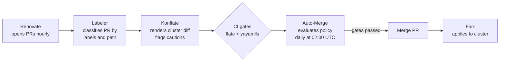

# Home Operations

<div align="center">


### HomeOps repo managed by k8s :wheel_of_dharma:

_... automated via [Flux](https://github.com/fluxcd/flux2), [Renovate](https://github.com/renovatebot/renovate) and [GitHub Actions](https://github.com/features/actions)_ :robot:

</div>

<div align="center">

[](https://discord.gg/home-operations)&nbsp;&nbsp;
[](https://talos.dev)&nbsp;&nbsp;
[](https://kubernetes.io)&nbsp;&nbsp;
[](https://fluxcd.io)&nbsp;&nbsp;
[](https://github.com/axeII/home-ops/actions/workflows/renovate.yaml)

</div>

<div align="center">

[](https://github.com/axeII/home-ops/blob/main/README.md#-hardware)&nbsp;&nbsp;
[](https://github.com/pre-commit/pre-commit)&nbsp;&nbsp;
[](https://grafana.com/cloud)

</div>

<div align="center">

[](https://github.com/kashalls/kromgo)&nbsp;&nbsp;
[](https://github.com/kashalls/kromgo)&nbsp;&nbsp;
[](https://github.com/kashalls/kromgo)&nbsp;&nbsp;
[](https://github.com/kashalls/kromgo)&nbsp;&nbsp;
[](https://github.com/kashalls/kromgo)&nbsp;&nbsp;
[](https://github.com/kashalls/kromgo)

</div>

---

## 🤔 What is this?

A production-grade Kubernetes homelab running real services — fully managed as code, fully automated, and fully in the open. This repository is the single source of truth for the cluster: every deployment, every network policy, and every secret lives here. Renovate opens PRs, konflate reviews them, CI validates them, and the auto-merge pipeline lands safe changes without human toil. The cluster reconciles itself through Flux.

It is also a reference for anyone curious about running Kubernetes at home. Whether you want to borrow a single app configuration or bootstrap your own cluster from scratch, everything you need is here.

## ⛵ Kubernetes Cluster at a glance

My setup is a three [Talos Linux](https://www.talos.dev) control-plane nodes — a minimal, immutable, API-driven Kubernetes distribution — running on Proxmox with [Rook-Ceph](https://rook.io) for distributed storage.

| Area | What's running |
| --- | --- |
| **Networking** | [Cilium](https://cilium.io) — eBPF-based CNI, kube-proxy replacement · [Gateway API](https://gateway-api.sigs.k8s.io/) — dual gateways with cert-manager TLS · [cloudflared](https://github.com/cloudflare/cloudflared) — tunnel ingress · [external-dns](https://github.com/kubernetes-sigs/external-dns) — DNS sync |
| **Storage** | [Rook-Ceph](https://rook.io) — distributed block storage · [csi-driver-nfs](https://github.com/kubernetes-csi/csi-driver-nfs) — NFS media shares · [VolSync](https://github.com/backube/volsync) + [Kopia](https://kopia.io) — PVC backup and replication |
| **Secrets** | [SOPS](https://github.com/getsops/sops) + Age — encrypted secrets in Git · [external-secrets](https://github.com/external-secrets/external-secrets) + 1Password Connect · [cert-manager](https://cert-manager.io/) — Let's Encrypt TLS |
| **GitOps** | [Flux CD](https://fluxcd.io) — GitOps operator · [Renovate](https://github.com/renovatebot/renovate) — automated updates · [Reloader](https://github.com/stakater/Reloader) — pod restart on config change · [KEDA](https://keda.sh/) — event-driven autoscaling |
| **Observability** | [VictoriaMetrics](https://victoriametrics.com/) + [VictoriaLogs](https://victoriametrics.com/victorialogs/) — metrics and logs · [Grafana](https://grafana.com/) — dashboards · [Gatus](https://gatus.io/) — health checks · [Coroot](https://coroot.com/) — APM · [Kromgo](https://github.com/kashalls/kromgo) — badges · [Chaski](https://github.com/axeII/chaski) — alert routing |
| **Utilities** | [Spegel](https://github.com/spegel-org/spegel) — P2P image mirroring · [Metrics Server](https://github.com/kubernetes-sigs/metrics-server) · [Intel GPU Plugin](https://github.com/intel/intel-device-plugins-for-kubernetes) — hardware transcoding · [Dragonfly](https://www.dragonflydb.io/) — Redis-compatible cache |

### 💾 Hardware

All Kubernetes nodes are Talos Linux VMs running on Proxmox.

| Device                         | OS Disk   | Data Disk | RAM  | Details                                   |
| ------------------------------ | --------- | --------- | ---- | ----------------------------------------- |
| **Proxmox VE**                 | NVMe      | NVMe      | 64GB | Main hypervisor                           |
| k8s-0 (VM)                     | 250GB     | 250GB     | 32GB | Talos control-plane, Intel ARC GPU        |
| k8s-1 (VM)                     | eMMC 30GB | 250GB     | 32GB | Talos control-plane                       |
| k8s-2 (VM)                     | 1TB SSD   | 250GB     | 32GB | Talos control-plane, e1000e driver        |
| TrueNAS SCALE (VM)             | SSD 20GB  | 40TB ZFS  | 64GB | NFS/SMB storage — 4x10TB HDD RAIDZ2       |
| Unifi UDM Pro                  | SSD 14GB  | HDD 1TB   | 4GB  | Router and security gateway               |
| Unifi Switch 16 PoE            | N/A       | N/A       | N/A  | PoE+ switch                               |
| Offsite VM                     | 60GB      | 8TB       | 8GB  | Offsite backup target                     |

## 🔧 How it stays automated

Every dependency update follows the same fully-automated path from Renovate to the cluster — no human toil for routine changes.



**Auto-merge policy** — the rules that decide whether a Renovate PR gets merged automatically or waits for human review:

| Category | Min age | Day constraint | Konflate gate | Auto-merge |
| --- | --- | --- | --- | --- |
| Patch / digest (`type/patch`, `type/digest`) | 2 days | Any | No failures, no cautions | Yes |
| Minor (`type/minor`) | 3 days | Fri–Sat (Europe/Berlin) | No failures, no cautions | Yes |
| Major — GitHub Actions (`type/major` + `renovate/github-action`) | 2 days | Any | No failures (cautions allowed) | Yes |
| Major — other (`type/major`) | — | — | — | Manual |
| Rook-Ceph, Cilium, Flux, Dragonfly | — | — | — | Manual |
| `area/talos` label | — | — | — | Manual |

- **Quiet window**: Sunday 00:00–05:00 UTC — no merges scheduled (Talos upgrade window).
- **Sleep between merges**: 5 minutes (10 for minor release train) to let Flux reconcile before the next merge.
- **Konflate** renders the full cluster diff for each PR, posts a blast-radius summary comment, and gates merges on render status. It runs inside the home network and is reachable as a best-effort check from GitHub Actions — the label/age/day gates are the hard floor.
- Safe PRs are squash-merged automatically; high-blast-radius changes (Ceph, Talos, non-action majors) always require a human review.

## 📂 Repo layout

```sh
📁 kubernetes      # Cluster defined as code
├─📁 flux          # Flux configuration — meta repos, cluster kustomization
├─📁 apps          # Applications grouped by namespace
└─📁 components    # Reusable Kustomize components (common labels, volsync, keda)

📁 talos           # Talos Linux node configuration, patches, and secrets
📁 scripts         # Bootstrap, backup, and validation helpers
📁 bootstrap       # Core-operator Helmfile for initial cluster bootstrapping
```

## 📱 Applications

### Media

| App | Description |
| --- | ----------- |
| [Plex](https://plex.tv) | Media server and streaming |
| [Plex-Music](https://github.com/axeII/chromatix) | Music streaming via Plexamp |
| [Sonarr](https://sonarr.tv) | TV show collection manager |
| [Radarr](https://radarr.video) | Movie collection manager |
| [Prowlarr](https://prowlarr.com) | Torrent/usenet indexer manager |
| [Sabnzbd](https://sabnzbd.org) | Usenet downloader |
| [Unpackerr](https://unpackerr.zip) | Auto-extracts downloaded archives |
| [Recyclarr](https://recyclarr.dev) | Syncs TRaSH Guides profiles |
| [FlareSolverr](https://github.com/FlareSolverr/FlareSolverr) | Cloudflare anti-bot bypass |
| [Seerr](https://github.com/seerr-team/seerr) | Media request management |
| [Tautulli](https://tautulli.com) | Plex statistics and monitoring |
| [Komga](https://komga.org) | Comic/manga/ebook library |
| [Kapowarr](https://github.com/Casvt/Kapowarr) | Comic book collection manager |

### Home & Productivity

| App | Description |
| --- | ----------- |
| [Home Assistant](https://www.home-assistant.io) | Home automation platform |
| [Glance](https://github.com/glanceapp/glance) | Personal dashboard |
| [Karakeep](https://github.com/karakeep-app/karakeep) | Bookmark manager |
| [Paperless-ngx](https://docs.paperless-ngx.com) | Document management with OCR |
| [Docmost](https://docmost.com) | Collaborative wiki and notes |
| [AFFiNE](https://affine.pro) | Knowledge base workspace |
| [Atuin](https://atuin.sh) | Shell history sync server |

### Infrastructure & Networking

| App | Description |
| --- | ----------- |
| [Cloudflare Tunnel](https://developers.cloudflare.com/cloudflare-one/connections/connect-networks) | Secure external ingress |
| [Echo Server](https://github.com/mendhak/http-https-echo) | Ingress/connectivity testing |
| [Proxmox](https://www.proxmox.com) | Reverse proxy to hypervisor |
| [TrueNAS](https://www.truenas.com) | Reverse proxy to storage |
| [Minecraft](https://minecraft.net) | Game server |

## 🚀 Self-host your own

This repo is a living reference — borrow what you like, ignore what you don't. Here is how to go from zero to your own cluster.

### Prerequisites

- **A domain** with DNS managed by a provider external-dns supports (Cloudflare, Route53, etc.).
- **A secrets backend** — this repo uses 1Password Connect + external-secrets, but anything with an external-secrets provider works.
- **An Age key** for SOPS-encrypted secrets (`age-keygen`).
- **Workstation tooling**: `talosctl`, `flux`, `just`, `helmfile`, `talhelper`, `sops`, `kubectl`.
- **Nodes**: at least one Talos-capable machine (bare metal, Proxmox VM, or any hypervisor). Three control-plane nodes are recommended.

### What to swap when forking

This repo is opinionated and personal. These are the hardcoded values you will need to change:

| Find | Replace with |
| --- | --- |
| `juno.moe` (Cloudflare zone) | Your domain |
| `CZ` (WAF country filter) | Your country |
| `192.168.69.x` (node IPs) | Your subnet |
| 1Password Connect references | Your secret backend |
| Proxmox / TrueNAS backends | Your hypervisor and NAS |
| `external.juno.moe` (tunnel hostname) | Your tunnel endpoint |
| `kromgo.juno.moe`, `konflate.juno.moe` | Your monitoring hosts |

### Bootstrap path

Once you have edited `talos/patches/` to match your hardware, follow these steps:

```sh
just talos-genconfig      # Regenerate Talos configs from patches
just bootstrap-age-key    # Generate SOPS Age key (age.key)
just bootstrap-talos      # Apply Talos config, bootstrap cluster, fetch kubeconfig
just bootstrap-apps       # Deploy core operators (Cilium, cert-manager, Flux) via Helmfile
```

At this point Flux takes over and reconciles everything under `kubernetes/` into the cluster.

### Reference material

- [onedr0p/cluster-template](https://github.com/onedr0p/cluster-template) — a friendlier fork target and step-by-step guide.
- [kubesearch.dev](https://kubesearch.dev) — search homelab Kubernetes configs for app-level examples.
- [k8s-at-home](https://k8s-at-home.com) — community hub for running Kubernetes at home.

## 💬 Community

This project is part of the [home operations](https://discord.gg/home-operations) community (previously k8s-at-home). Join us on Discord for discussion, help, and inspiration.

Feel free to check out my blog at [axell.dev](https://axell.dev) — also [open source](https://github.com/axeII/my-blog) — which includes a [hardware walkthrough](https://axell.dev/favorite/my-home-lab/) covering what worked and what didn't.

## 🔏 License

See [LICENCE](./LICENCE).
